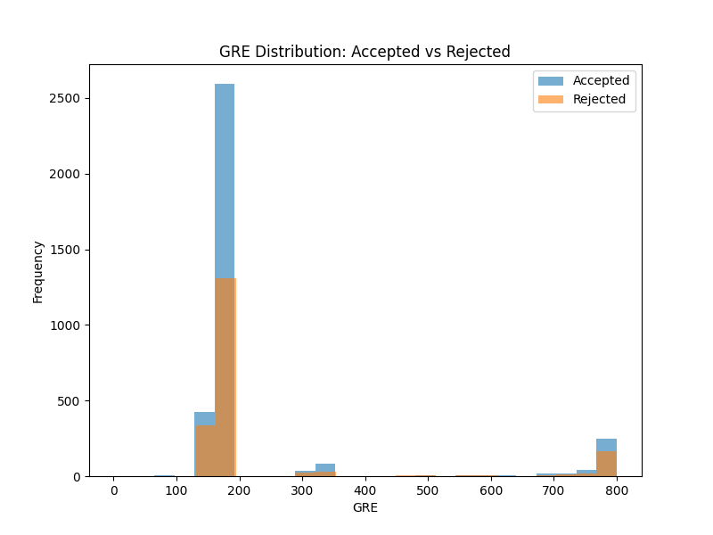
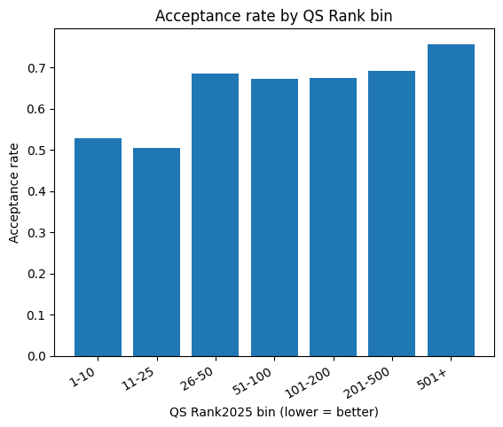

# DSA210Project

# Graduate Admission Prediction 

## Project Overview
This project aims to build a predictive model that estimates the chance of graduate school admission based on applicant profiles collected from **TheGradCafe.com**. 

To enrich this dataset, I will be also using **QS World University Rankings by Subject 2025: Computer Science and Information Systems**. 

By combining applicant-level data with institutional quality metrics, this project seeks to identify the key factors that most strongly influence graduate admission outcomes and predict whether a student will be accepted to their target school. Moreover I believe that over a siginificant threshold, GPA doesn't have it's assumed impact on the applications as it does under the threshold. I am interested in finding the threshold.

---

## Motivation
As a Computer Sceince major who severly thinks about applying for a master's degree, the data I will examine through this project are what I am searching on regularly. I used to enjoy to watch an instagram account called limmytalks. Limmy has around 1000 posts on evaluating applications of students for college and trying to guess their results. I wish he would do the same content for masters applications too. But since he doesn't I will do my own masters limmytalks project. As I stated, I am searching for masters programs to apply and I usually compare myself to the student records I find in internet that accepted. At the end of this projects we will have a very detailed outcome of my chance for a masters program in Computer Science based on data rather than just surfing in internet.This personal motivation directly leads to the core research question of this project: whether GPA reaches a saturation point in admission decisions, and how institutional prestige interacts with applicant profiles.


---

## Data Sources

### 1. Applicant Data
- **Source:** TheGradCafe.com (https://www.thegradcafe.com/survey/?q=&sort=newest&institution=&program=Computer+Science&degree=Masters&season=&decision=&decision_start=&decision_end=&added_start=&added_end=)  
- **Description:** Crowdsourced reports of graduate school applications including: University name, Program, Degree type, GPA, GRE (where available), Decision status (Accepted / Rejected / Waitlisted), Admission term and season...

### 2. University Data (Data Enrichment)
- **Source:** QS World University Rankings by Subject 2025 — Computer Science & Information Systems (https://www.topuniversities.com/university-subject-rankings/computer-science-information-systems?tab=indicators&countries=us&sort_by=rank&order_by=asc)
- **Description:**  Publicly available dataset that provides university-level metrics such as Academic Reputation, Employer Reputation, Citations per Paper... These indicators quantify institutional quality and will be merged with GradCafe entries to enrich applicant-level data.


---

## Data Collection and Preprocessing

### Step 1: Data Collection of GradCafe
- **Tool:** Selenium with ChromeDriver 
- **Process:**  
  - Automatically load each page of GradCafe results filtered for *Computer Science* and *Masters*. Done in 2 parts since there is a filter for decision, I filtered the results as accepted and rejected. Then I did web scraping and merged them later.
  - Extracted structured data fields: university,program,decision,term,citizenship,gpa_raw,gre_total,gre_q,gre_v,gre_aw.
  - Did university name normalization to be able to merge with QS data.
  

### Step 1: Data Collection of QS world ranking
- **Process:**  
  - There is no need for any tool. You can download it as excel from the website.
  - In the QS_Cleaning.py script, I preprocess the QS World Ranking dataset to make it suitable for analysis. The script converts non-standard rank formats (such as “=2”, “201–250”, or “201+”) into consistent numeric values, normalizes decimal notation by replacing commas with periods, and ensures all score-related columns are properly cast as numeric types. It also standardizes university names through text normalization to support reliable merging with the GradCafe dataset. Finally, the cleaned and structured dataset is exported as qs_ranking_clean.csv for further analysis.

### Step 2: Data Cleaning: GradCafe

- Constructed a mising data test for gradcafe merged data. Results:
```text
     Column       Non-Null Count  Dtype  
---  ------       --------------  -----  
 0   university   16231 non-null  object 
 1   program      16246 non-null  object 
 2   decision     16246 non-null  object 
 3   term         15317 non-null  object 
 4   citizenship  14912 non-null  object 
 5   gpa_raw      8416 non-null   float64
 6   gre_total    7380 non-null   float64
 7   gre_q        0 non-null      float64
 8   gre_v        7187 non-null   float64
 9   gre_aw       6952 non-null   float64
```
- As it is seen I have enough data, I decided to remove rows with missing university, term, citizenship and gpa. I considered to handle missing gpa values by mean/mediean but due to gpa being one of the most important attributes, size of gpa handled data would be bigger than the size of original gpa data and having enough big data even after removing missing gpa rows I decided to deleting the rows with missing gpa value. After dropping rows with missing university, term, citizenship and gpa I had a dataframe with size approximetly 7000. I again conducted a missing test and exmaine that gre total has 5828 non-null rows. I dropped the rows with missing gre_total. Moreover, other attributes related with gre will also be dropped to prevent unneeded complexity.
- I don't have any missing data in decision column since I have filtered it before scraping.
- Normalize university names (case, punctuation, abbreviations).
- Standardized terms. There are different formats as F19, Fall 2019...
- Handle missing GRE scores.
- Outlier check
- Histograms, acceptance rate by year change, domestic vs international, Correlation heatmap.

### Step 2: Data Cleaning: QS world ranking
- Constructed a mising data test. Results:
```text
=== Missing Value Summary (QS Dataset) ===
                     missing_count  missing_percent
Score                          650            76.47
2024                           133            15.65
Rank2024                       133            15.65
2025                             0             0.00
Rank2025                         0             0.00
IRN Rank                         0             0.00
IRN                              0             0.00
H Rank                           0             0.00
H                                0             0.00
CPP Rank                         0             0.00
Citations                        0             0.00
ER Rank                          0             0.00
Employer                         0             0.00
AR rank                          0             0.00
Academic                         0             0.00
Country / Territory              0             0.00
Institution                      0             0.00
institution_clean                0             0.00
```
- Since these fields contain substantial or non-negligible levels of missing data, and because they are not essential for the merging process with the GradCafe dataset, they will be removed from further analysis. All remaining variables have 0% missingness and can be safely retained.


### Step 4: Data Enrichment
- Merge GradCafe dataset with QS dataset using approximate string matching since “UCLA”, “Univ. of California Los Angeles”, “University of California at LA” are actually all same.
- Convert qualitative ranks (“21+”, “201+”) into numeric bounds.
- Handle missing QS features.

### Step 5: Feature Engineering
- Encode categorical variables (degree type, term).
- Scale numerical features (GPA, ranking scores).
- Create binary variable: `International = 1`, `American = 0`.

---

## Analysis Plan

### Exploratory Data Analysis Plan (EDA)
- Examine overall data structure, missing values, duplicates, and outliers
- Visualize GPA, GRE, QS Rank, and other numerical features using histograms, density plots, and boxplots.
- Compare GPA and GRE distributions for accepted vs rejected applicants.
- Analyze the GPA to acceptance relationship with binned acceptance rates, moving averages, and non-linear smoothing to identify a potential GPA saturation threshold.
- Investigate QS Rank effects via scatterplots, rank bins, and Pearson/Spearman correlation analysis.
- Compare domestic vs international applicants across GPA, GRE, acceptance rates, and target school rank profiles.
- Explore temporal trends by examining acceptance rates, GPA trends, and QS Rank targets over application years.
- Conduct multivariate analysis using pairplots and correlation heatmaps to evaluate interactions among GPA, GRE, QS indicators, and outcomes.

### Exploratory Data Analysis (EDA): GradCafe
- Summary statistics of Gradcafe:
```text
=== GPA Summary Statistics by Decision ===
           count      mean       std   min   25%   50%   75%  max
decision                                                         
Accepted  3495.0  3.648466  0.278167  0.90  3.50  3.70  3.86  4.0
Rejected  1920.0  3.609307  0.282759  2.19  3.42  3.68  3.82  4.0

=== GRE Summary Statistics by Decision ===
           count        mean         std  min    25%    50%    75%    max
decision                                                                 
Accepted  3495.0  230.170529  180.673939  1.0  164.0  168.0  170.0  800.0
Rejected  1920.0  237.345833  191.523309  3.0  164.0  168.0  170.0  800.0
```
- GPA Distribution: Accepted vs Rejected:


- GRE Distribution: Accepted vs Rejected:


- Mean Comparison:
```text

=== GPA Mean Comparison ===
Accepted: 3.6484663805436335
Rejected: 3.609307291666667
GPA t-test: TtestResult(statistic=np.float64(4.926675996473234), pvalue=np.float64(8.612983526220928e-07), df=np.float64(5413.0))

=== GRE Mean Comparison ===
Accepted: 230.17052932761086
Rejected: 237.34583333333333
GRE t-test: TtestResult(statistic=np.float64(-1.3683575253402944), pvalue=np.float64(0.17125698363362132), df=np.float64(5413.0))
```

### Exploratory Data Analysis (EDA): QS Wolrd Ranking


### Hypotheses

- GPA SATURATION EFFECT
- Null Hypothesis (H0): Increases in GPA continue to significantly increase the probability of acceptance across the full GPA range.
- Alternative Hypothesis (H1): There exists a GPA threshold τ beyond which additional increases in GPA do not significantly increase the probability of acceptance.

### Hypotheses Testing: GPA SATURATION EFFECT
To capture a possible “breakpoint,” I used a piecewise logistic regression. Because τ is unknown, I performed a grid search over τ ∈ [2.50, 3.95] (step 0.05) and selected the best τ based on AIC (lower is better). The full search results are stored in results_hyp1/tau_search.csv.

For each candidate threshold τ, I defined a post-threshold term gpa_over=max(0,GPA−τ) and fit: logit(P(Accepted))=β0​+β1​⋅GPA+β2⋅gpa_over+controls​.

If saturation exists, the post-threshold effect β₂ should be near zero and mathematically insignificant. 

- Acceptance rate binned: GPA


The best breakpoint was τ = 3.2 (AIC ≈ 4762.60, n = 3790). Importantly, the post-threshold term remained positive and statistically significant, meaning GPA increases after 3.2 are still associated with higher acceptance probability. Therefore, I do not find evidence of saturation and fail to support H1; the results are more consistent with H0, where GPA continues to matter even it gets too close to 4.

- UNIVERSITY RANK INFLUENCE
- Null Hypothesis (H0): University QS Rank has no significant association with admission outcomes.
- Alternative Hypothesis (H1): University QS Rank is significantly associated with admission outcomes, such that better-ranked universities exhibit higher acceptance probabilities.

### Hypotheses Testing: UNIVERSITY RANK INFLUENCE

I tested whether QS Rank2025 is related to admission decisions in the merged dataset. Because rank values are skewed, I used log_rank = log(Rank2025) and ran logistic regression (Accepted=1, Rejected=0). The model outputs are in results_hyp2/rank_models_summary.txt.

Result: log_rank is significant (p < 0.001), so QS rank is associated with outcomes. However, the coefficient is positive, meaning worse rank (higher number) → higher acceptance probability in our data. This also appears in the binned plot/table: acceptance increases from about 0.53 (rank 1–10) to about 0.76 (rank 501+).
So I reject H0, but the direction is the opposite of the original expectation—likely because applicants treat lower-ranked schools as “safer” options and GradCafe reports are not a perfectly balanced sample.

- Acceptance rate binned: QS rank


### Statistical Analysis

- Test whether GPA and university QS Rank significantly influence admission outcomes in alignment with the project’s two main hypotheses.
- Apply piecewise logistic regression and changepoint detection methods to evaluate the GPA Saturation Hypothesis and statistically estimate the threshold τ, where increases in GPA no longer contribute meaningfully to acceptance probability.
- Use generalized additive models (GAM) or non-linear smoothing techniques to examine whether the GPA–acceptance curve flattens beyond the threshold τ.
- Analyze the impact of university prestige by evaluating the relationship between QS Rank and admission outcomes using logistic regression coefficient significance tests and Spearman rank correlation.
- Perform chi-square tests of independence for categorical comparisons when appropriate, following the course’s hypothesis-testing framework.
- Report p-values, confidence intervals, and effect sizes, and make decisions on rejecting or failing to reject each null hypothesis under a standard significance level (α = 0.05).

### Predictive Modeling
- Develop classification models to predict admission results.
- Possible Algorithms: Logistic Regression, Random Forest, XGBoost etc.
- Evaluate with accuracy, precision-recall, F1 score, and ROC-AUC.
- Use SHAP analysis to interpret feature importance and model decisions.

### Deliverables
- Cleaned and merged dataset
- EDA visualizations
- Trained predictive models
- Model interpretability analysis
- Final written report and GitHub repository with documentation

---

## Expected Challenges
- Name inconsistencies between GradCafe and QS data.
- Missing or biased user-reported entries on GradCafe.
- Balancing class distribution (more rejections than acceptances, more international than american applicants).

---

## Tools and Technologies
- **Languages:** Python (pandas, numpy, selenium, fuzzywuzzy, scikit-learn, matplotlib, seaborn)
- **Data Collection:** Selenium
- **Analysis:** pandas, sklearn
- **Visualization:** seaborn, matplotlib
- **Version Control:** GitHub

---

## Limitations and Future Work
- GradCafe data may not represent all applicants.
- Future work may integrate textual analysis of applicant comments or funding outcomes for deeper insights.


